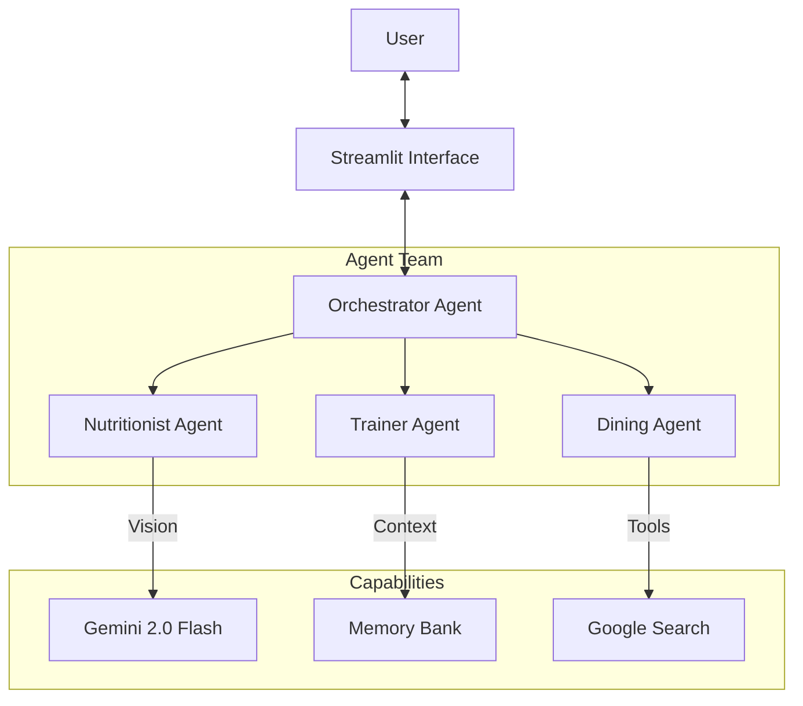

# FitSync: Your AI Wellness Concierge 🏋️‍♂️🥗

FitSync is a multi-agent conversational concierge designed to reduce the friction of living a healthy lifestyle. Unlike passive tracking apps, FitSync actively "watches" what you eat via photos and adjusts your fitness plan in real-time based on your feedback. It combines a Nutritionist Agent, a Trainer Agent, and a Dining Assistant into a single, cohesive chat interface.

This project was built for the **Google AI Agents Intensive Capstone (Concierge Agents Track)**.

---

## 🎥 Project Video
[[Link to YouTube Video Demo]([https://youtube.com/...](https://youtu.be/E-sCsYV7vGs))](https://youtu.be/E-sCsYV7vGs)

---

## 🚀 Key Features

*   **📸 Visual Calorie Logging:** Simply upload a photo of your meal. The **Nutritionist Agent** uses multimodal AI to estimate calories and macros instantly—no manual entry required.
*   **💪 Adaptive Workout Advice:** Tell FitSync if your "knee hurts" or you're "feeling low energy." The **Trainer Agent** modifies your workout plan in real-time to suit your physical state.
*   **🍽️ Smart Dining Recommendations:** Going out to eat? Just name the restaurant. The **Dining Agent** (powered by Google Search) retrieves the menu and recommends healthy dishes that fit your goals.
*   **🧠 Long-Term Memory:** FitSync remembers who you are. Your name, goals, allergies, and injuries are persisted across sessions, so you never have to repeat yourself.

---

## 🏗️ Architecture

FitSync is built as a **Multi-Agent System** orchestrated by a central brain.



### How it Works
1.  **Orchestrator:** The main brain that analyzes your input to determine intent. It routes your request to the best specialist (Nutrition, Fitness, or Dining) or handles general chat itself.
2.  **Specialized Agents:**
    *   **Nutritionist:** Analyzes food images and logs nutrition.
    *   **Trainer:** Provides workout adjustments and fitness advice.
    *   **Dining Assistant:** Finds healthy options at restaurants.
3.  **Memory Bank:** A persistent storage layer that keeps track of your profile (goals, injuries, preferences) and injects this context into every agent interaction.

---

## ✅ Capstone Requirements Met

This project demonstrates the following key concepts from the AI Agents Intensive:

1.  **Multi-Agent System:** Uses a team of specialized agents (Nutritionist, Trainer, Dining) coordinated by an Orchestrator.
2.  **Agent Powered by LLM:** All agents are powered by Google's **Gemini 2.0 Flash** model.
3.  **Tools:** Implements custom tools (e.g., `remember_fact`) and external tools (Google Search for menus).
4.  **Sessions & Memory:** Features a robust **Memory Bank** that persists user context (allergies, injuries, goals) across conversations.

---

## 🛠️ Setup & Installation

### Prerequisites
*   Python 3.10+
*   A Google Cloud Project with the Gemini API enabled.
*   An API Key from [Google AI Studio](https://aistudio.google.com/).

### Installation

1.  **Clone the Repository**
    ```bash
    git clone https://github.com/yourusername/wellness-coach-capstone.git
    cd wellness-coach-capstone
    ```

2.  **Install Dependencies**
    ```bash
    pip install -r requirements.txt
    ```

3.  **Set Up Environment Variables**
    Create a `.env` file in the root directory and add your Google API Key:
    ```env
    GOOGLE_API_KEY=your_api_key_here
    ```

4.  **Run the Application**
    ```bash
    streamlit run app.py
    ```

---

## 📖 Usage Guide

1.  **Onboarding:** When you first launch the app, you'll be asked to create a profile (Name, Age, Goals, Injuries). This data is saved to your Memory Bank.
2.  **Chat:** Use the chat interface to ask questions like:
    *   *"I have knee pain, can you adjust my leg day?"*
    *   *"What should I eat at The Cheesecake Factory?"*
3.  **Food Logging:** Click the **"Upload Food Photo"** expander, upload an image of your meal, and ask *"How many calories are in this?"*

---

## 📄 License
MIT License
